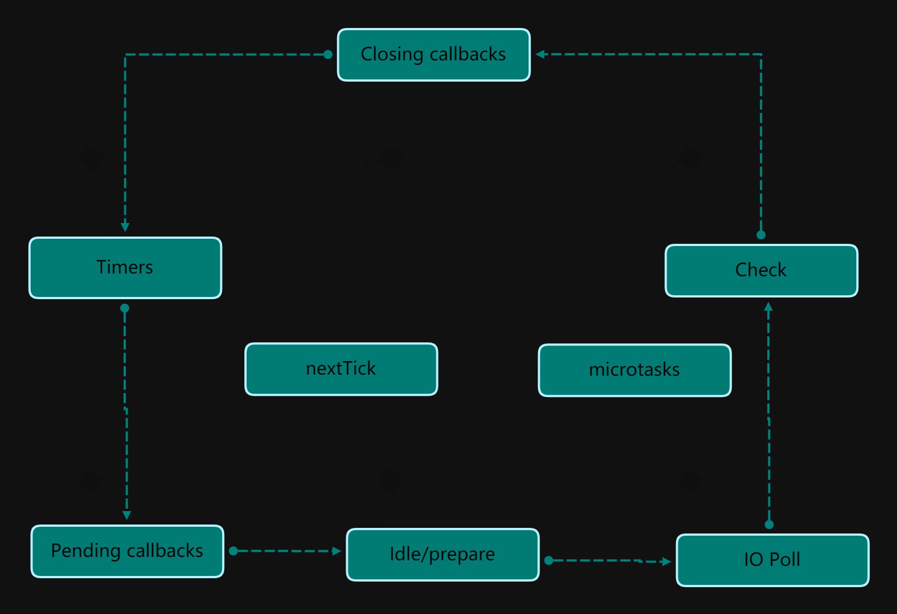

# 异步编程

## CPU 与 存储器

- CPU

  - 中央处理器，计算机核心部件，负责运算和指令调用
  - JavaScript 代码在被编译为机器码以后就是通过 CPU 执行的

- 存储器
  - 内存：临时存储数据，断电后数据会丢失，数据读写速度快，计算中的应用程序都在内存中运行
  - 磁盘：持久存储数据，读写数据慢

## 进程与线程

- 运行应用程序时，操作系统都会创建该应用的实例对象，该实例对象就是应用程序的进程
- 操作系统会按照进程为单位为应用程序分配资源
- 线程被包裹在进程中，是进程中实际运作单位
- 一条线程指的是进程中的一个单一顺序的控制流
- 应用程序要做的事情都存储在线程之中，一条线程就是一个代表事项，供 CPU 执行


## 基于回调函数的异步编程

### 回调函数

- 回调函数指通过函数参数的方式将一个函数传递到另一个函数中，参数就是回调函数

```js
function A() {
  consolg.log("A is running");
}

function B(callback) {
  console.log("B start");
  callback();
  console.log("B end");
}

B(A);
```

### 回调函数传参

- 在主函数中调用回调函数时，可以为回调函数传递参数

```js
function A(arg) {
  console.log("A is running");
  console.log(arg);
}

function B(callback) {
  console.log("B start");
  callback("B 传递个 A 的参数");
  console.log("B end");
}

B(A);
```

### 应用

- 在异步编程中， 异步 API 执行的结果就是通过回调函数传参的方式，传递到上层代码中

```js
const fs = require("fs");

fs.readFile("./index.html", "utf-8", function (error, data) {
  if (error) console.log(error);
  console.log(data);
});
```

### 回调地狱

- 回调函数多层嵌套导致代码难以维护

```js
const fs = require('fs')

fs.readFile('./index.html', 'utf-8', function(error, data1){
  if(error) console.log(error)

  fs.readeFile('./index2.html', 'utf-8' function(error, data2){
    if(error) console.log(error)

    console.log(data1)
    console.log(data2)
  })
})
```

## 基于 Promise 的异步编程

### Promise 概述

- 是 JavaScript 异步编程解决方案，可以解决回调函数嵌套过深的问题
- Promise 包裹者异步 API，异步 API 执行完毕，Promise 允许在外面获取异步 API 的执行结果，避免函数嵌套
- Promise 表示为承诺，承诺做一件事情，事情的结果要么是成功要么是失败
- Promise 有三只状态，等待(pending)、成功(fulfilled)、失败(rejected)
- 默认状态为等待，只能从等待变为成功，或从等待变为失败，，状态一旦改变就不允许更改

### Promise 基础语法

```js
const fs = require("fs");

const promise = new Promise(function (resolve, reject) {
  fs.readFile("./index.html", "utf-8", function (error, data) {
    if (error) {
      // 等待 => 失败
      reject(error);
    } else {
      // 等待 => 成功
      resolve(data);
    }
  });
});

promise
  .then(function (data) {
    console.log(data);
  })
  .catch(function (error) {
    console.log(error);
  });
```

### Promise 链式调用

```js
const fs = require("fs");

function readFile(path) {
  return new Promise(function (resolve, reject) {
    fs.readFile(path, "utf-8", function (error, data) {
      if (error) {
        reject(error);
      } else {
        resolve(data);
      }
    });
  });
}

readFile("./index.html")
  .then(function (v) {
    console.log(v);
    return readFile("index.txt");
  })
  .then(function (v) {
    console.log(v);
  })
  .catch(function (error) {
    console.log(error);
  })
  .finally(function () {
    console.log("finally");
  });
```

### Promise 并发操作

```js
const fs = require("fs");

function readFile(path) {
  return new Promise(function (resolve, reject) {
    fs.readFile(path, "utf-8", function (error, data) {
      if (error) {
        reject(error);
      } else {
        resolve(data);
      }
    });
  });
}

Promise.all([readFile("./index.html"), readFile("./index.txt")])
  .then(function (data) {
    console.log(data);
  })
  .catch(function (error) {
    console.log(error);
  });
```

## 基于异步函数的异步编程

```js
const fs = require("fs");

function readFile(path) {
  return new Promise(function (resolve, reject) {
    fs.readFile(path, "utf-8", function (error, data) {
      if (error) {
        reject(error);
      } else {
        resolve(data);
      }
    });
  });
}

async function run() {
  return [await readFile("./index.html"), await readFile("./index.txt")];
}

run().then(function (value) {
  console.log(value);
});
```

- async 是声明异步函数的关键字，异步函数的返回值会被自动填充到 Promise 对象中
- await 关键字后面只能放置返回 Promise 对象的 API
- await 关键字可以暂停函数的执行，等待 Promise 执行 返回的结果
- await 关键字只能出现在异步函数中

### util.promisify

- 在 Node.js 下，所有的异步方法都是基于回调函数的异步编程
- 可以使用 util 模块下的 promisify 方法 将基于回调函数的 API 转换成 Promise API

```js
const fs = require("fs");
const promisify = require("util").promisify;

const readFile = promisify(fs.readFile);

async function run() {
  return [
    await readFile("./index.html", "utf-8"),
    await readFile("./index.txt", "utf-8"),
  ];
}

run().then(function (value) {
  console.log(value);
});
```

## Event Loop（事件循环机制）

- 事件循环机制用于管理异步 API 的回调函数在什么时候回到主线程中执行
- Node.js 采用的异步 I/O 模型
  - 同步 API 在主线程上执行
  - 异步 API 在底层 C++ 维护的线程上执行，异步 API 的回调在主线程上执行

### 六个阶段



1. Timers: 用于存储定时器的回调函数（setInterval,setTimeout)
2. Pending callbacks: 执行与系统操作相关的回调函数，例如 启动服务器端应用时 监听操作的的回调函数在此调用
3. Idle, prepare: 系统内部使用
4. IO Poll: 存储 I/O 操作的回调函数队列，例如文件读写操作的回调函数

   - 如果事件队列中有回调函数，执行它们 直到清空队列
   - 否则事件循环将在此阶段停留一段事件，等待新的回调函数进入, 等待取决：
     - setImmediate 队列(Check 阶段) 存在要执行的回调函数
     - timers 队列中存在要执行的的回调函数
     - 以上情况下，事件循环将移至 Check 阶段，然后移至 Closing callbacks 阶段，并最终从 Timers 阶段进入下一次循环

5. Check: 存储 setImmediate API 的回调函数
6. Closing Callbacks: 执行与关闭相关的回调，例如关闭数据库链接的回调

**循环体会不断的运行以检测是否存在没有调用的回调函数，事件循环会按照先进先出的方式执行回调，直到队列清空**

### 宏任务与微任务

**宏任务：** setInterval、setTimeout、SetImmediate、I/O

**微任务：** Promise.then、Promise.cathc、Promise.finally、process.nextTick

**区别：**

- 微任务的回调被放置在微任务队列，宏任务的回调被放置在宏任务队列
- 微任务优先级高于宏任务
- 当微任务队列中存在可执行的回调函数时
  - 事件循环在执行完当前阶段的回调函数后会暂停进入事件循环的下一阶段
  - 事件循环会立即进入微任务队列中执行回调函数
  - 微任务队列中的回调执行完毕，事件循环在进入下一阶段
- nextTick 的优先级高于 microTask
  - 在任务执行时，只有 nextTick 中的所有回调函数执行完毕，才会执行 microTask
- 不同阶段的宏任务的回调函数放置在不同的宏任务队列中
- 宏任务没有优先级概念，执行顺序就是先进先出

### process.nextTick

- 如果希望异步任务尽可能早的执行，可以使用

### setImmediate

- JavaScript 的主线程时单线程的，主线程如果长时间被占用，其他任务就会被阻塞
- 主线程不适合做 CPU 密集型任务
- 如果在应用中避免不了，就应该将其变成异步操作，放入事件循环的 Check 阶段
- 当 运行到 Check 阶段时，当前所有微任务和宏任务的回调都已执行完毕，主线程处于空闲状态
- 要将任务放入 Check 阶段，需要使用 setImmediate 方法
